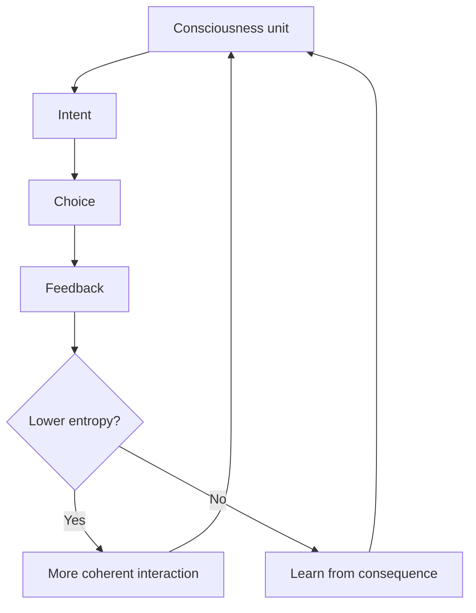
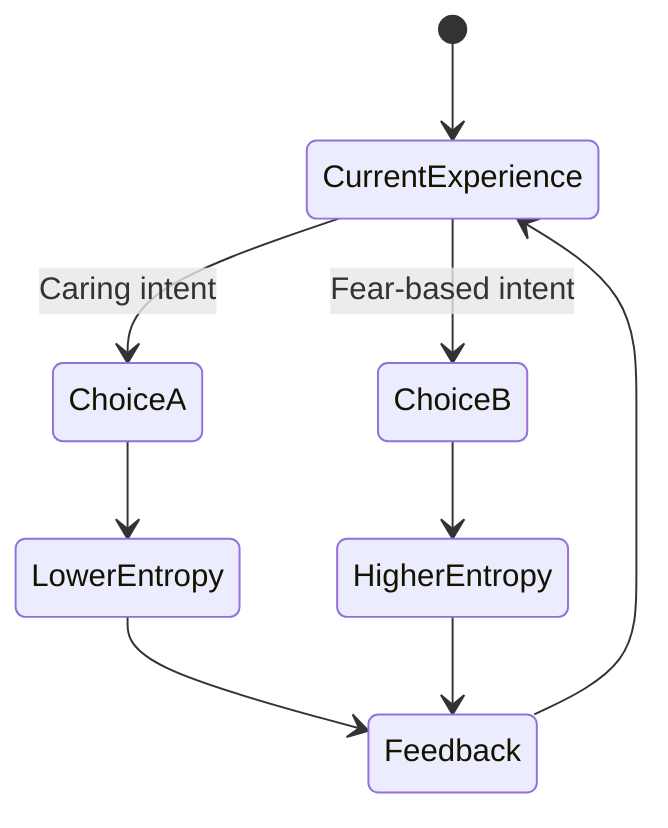

# My Big TOE inspired markdown demo

This test content is inspired by Thomas Campbell's *My Big TOE* vocabulary: consciousness, intent, entropy, feedback, probability, and virtual reality.

> [!NOTE]
> This demo is not an official summary of Thomas Campbell's work. It is sample markdown for testing rendering features.

## Consciousness feedback loop



## Probability and decision space



## Code formatting examples

JavaScript:

```js
const intent = 'coherent';
const entropyTrend = intent === 'coherent' ? 'lowering' : 'increasing';
console.log({ intent, entropyTrend });
```

HTML:

```html
<netsi-marked plugins="mermaid,code-enhance,callouts" locale="da">
  <template type="text/markdown">
# Hello virtual reality
  </template>
</netsi-marked>
```

CSS:

```css
netsi-marked {
  --netsi-marked-accent: #6f42c1;
  --netsi-marked-radius: 1rem;
}
```

## Table

| MBT term | Demo interpretation |
|---|---|
| Intent | Direction behind a choice |
| Feedback | Consequence data |
| Entropy | Coherence or disorder trend |
