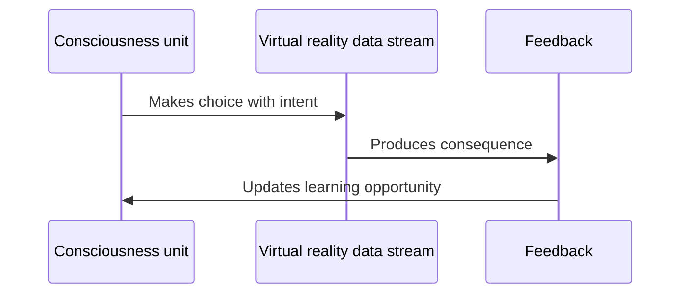

# Simple My Big TOE inspired example

A small markdown file for testing `src` loading.

```mermaid
sequenceDiagram
  participant IUOC as Consciousness unit
  participant VR as Virtual reality data stream
  participant FB as Feedback
  IUOC->>VR: Makes choice with intent
  VR->>FB: Produces consequence
  FB->>IUOC: Updates learning opportunity
```
